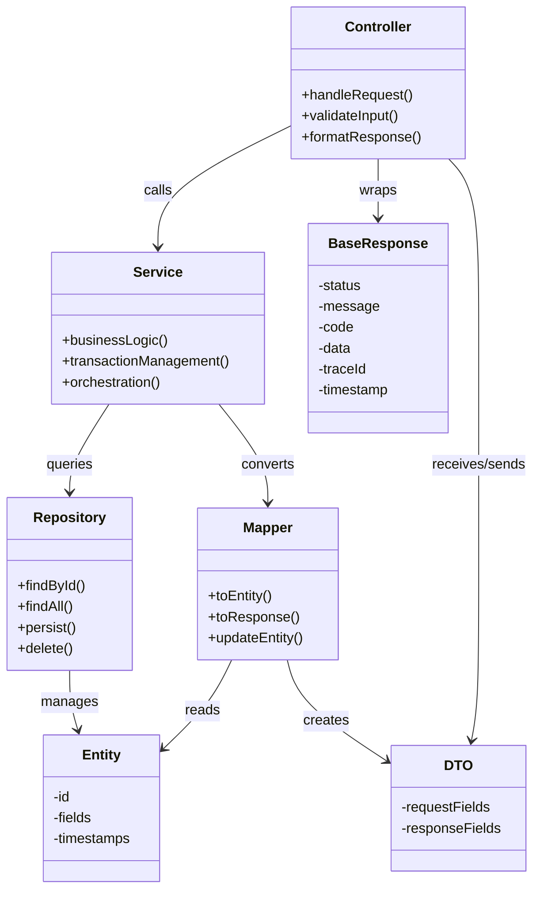
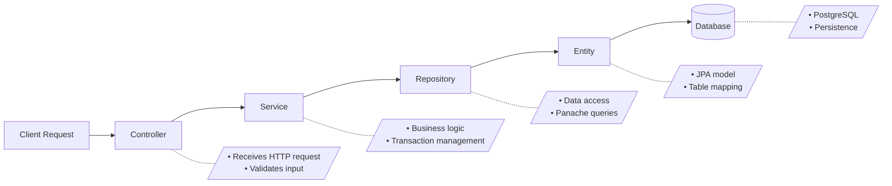
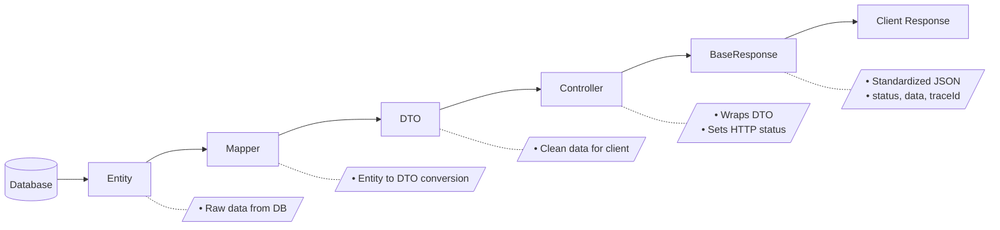
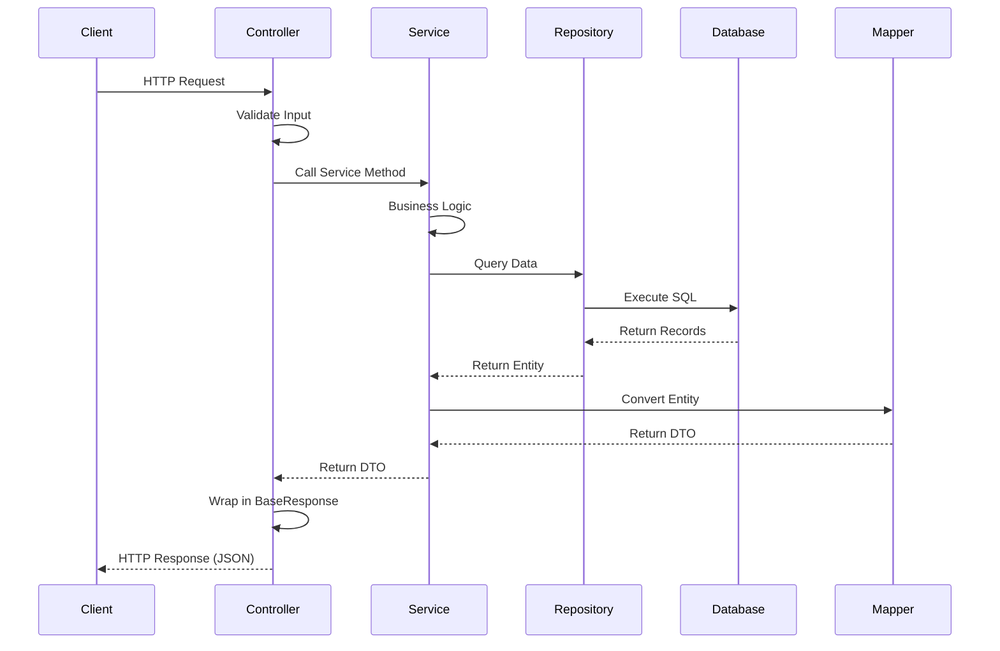
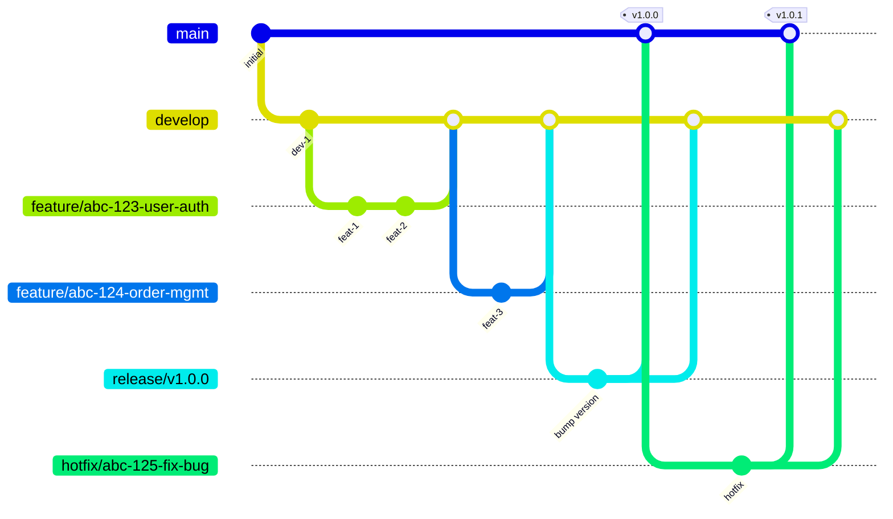
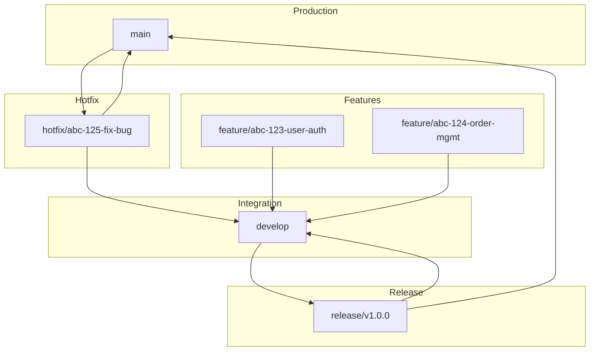

# Backend Development Guideline

**Version:** 1.0  
**Last Updated:** January 2025  
**Tech Stack:** Quarkus, PostgreSQL, Flyway

---

## Table of Contents

1. [Project Structure](#1-project-structure)
2. [Naming Conventions](#2-naming-conventions)
3. [Code Standards](#3-code-standards)
4. [API Design](#4-api-design)
5. [Response Standardization](#5-response-standardization)
6. [Database Guidelines](#6-database-guidelines)
7. [Logging Standards](#7-logging-standards)
8. [Validation](#8-validation)
9. [Git Workflow](#9-git-workflow)
10. [Code Review Checklist](#10-code-review-checklist)

---

## 1. Project Structure

### Architecture Overview



### Folder Structure

```
project-name/
├── src/
│   ├── main/
│   │   ├── java/
│   │   │   └── com/agora/projectname/
│   │   │       ├── config/
│   │   │       ├── controller/
│   │   │       │   ├── rest/
│   │   │       │   └── websocket/
│   │   │       ├── dto/
│   │   │       │   ├── users/
│   │   │       │   │   ├── request/
│   │   │       │   │   └── response/
│   │   │       │   ├── orders/
│   │   │       │   │   ├── request/
│   │   │       │   │   └── response/
│   │   │       │   └── common/
│   │   │       ├── entity/
│   │   │       ├── enums/
│   │   │       ├── exception/
│   │   │       ├── mapper/
│   │   │       ├── repository/
│   │   │       ├── service/
│   │   │       └── util/
│   │   ├── resources/
│   │   │   ├── application.yaml
│   │   │   ├── application-dev.yaml
│   │   │   ├── application-prod.yaml
│   │   │   └── db/migration/
│   │   └── docker/
│   │       ├── Dockerfile.jvm
│   │       └── Dockerfile.native
│   └── test/
│       ├── java/
│       └── resources/
├── pom.xml
└── README.md
```

### Request Lifecycle

Understanding how data flows through the application layers is essential for new developers.

#### Request Flow



#### Response Flow



#### Complete Request-Response Cycle



#### Flow Summary

| Direction | Flow |
|-----------|------|
| **Request** | `Client` → `Controller` → `Service` → `Repository` → `Entity` → `Database` |
| **Response** | `Database` → `Entity` → `Mapper` → `DTO` → `Controller` → `BaseResponse` → `Client` |

#### Layer Responsibilities

| Layer | Responsibility | Allowed Dependencies |
|-------|----------------|---------------------|
| **Controller** | HTTP handling, input validation, response formatting | Service, DTO |
| **Service** | Business logic, transaction management, orchestration | Repository, Mapper, other Services |
| **Repository** | Data access, queries, CRUD operations | Entity |
| **Mapper** | Object transformation between Entity and DTO | Entity, DTO |
| **Entity** | Database table representation | None (pure data model) |
| **DTO** | Data transfer objects for API contracts | None (pure data model) |

### Folder Descriptions

| Folder | Description |
|--------|-------------|
| `config/` | Configuration classes and application settings using `@ApplicationScoped` with producer methods |
| `controller/rest/` | REST endpoints using `@Path`, `@GET`, `@POST`, etc. |
| `controller/websocket/` | WebSocket endpoints for real-time communication |
| `dto/{feature}/request/` | Request payload objects grouped by business feature |
| `dto/{feature}/response/` | Response payload objects grouped by business feature |
| `dto/common/` | Shared DTOs used across multiple features (e.g., `PagedResult`, `StandardResponse`) |
| `entity/` | JPA entities with `@Entity` annotation |
| `enums/` | Enumeration classes |
| `exception/` | Custom exceptions and global exception handlers using `@ServerExceptionMapper` |
| `mapper/` | Object mappers for entity-DTO conversions |
| `repository/` | Data access layer using `PanacheRepository` |
| `service/` | Business logic layer with `@ApplicationScoped` |
| `util/` | Utility classes and helpers |

### Resources

| File/Folder | Description |
|-------------|-------------|
| `application.yaml` | Main configuration file |
| `application-dev.yaml` | Development profile. Activate with `-Dquarkus.profile=dev` |
| `application-prod.yaml` | Production profile settings |
| `db/migration/` | Flyway migration scripts |

---

## 2. Naming Conventions

### General Rules

| Element | Convention | Example |
|---------|------------|---------|
| Class name | PascalCase | `UserService`, `OrderController` |
| Variable name | camelCase | `userId`, `orderStatus` |
| Method name | camelCase | `findById()`, `createOrder()` |
| Constant | UPPER_SNAKE_CASE | `MAX_RETRY_COUNT`, `DEFAULT_PAGE_SIZE` |
| Package name | lowercase | `com.agora.projectname.service` |

### Database Naming

| Element | Convention | Example |
|---------|------------|---------|
| Table name | camelCase | `userAccount`, `orderItem` |
| Column name | camelCase | `userId`, `createdAt` |
| Primary key | `{tableName}Id` | `userId`, `orderId` |
| Foreign key | `{referencedTable}Id` | `userId` in `order` table |

### Class Naming by Layer

| Layer | Suffix | Example |
|-------|--------|---------|
| Entity | None or `Entity` | `User`, `UserEntity` |
| Repository | `Repository` | `UserRepository` |
| Service | `Service` | `UserService` |
| Controller | `Controller` | `UserController` |
| DTO Request | `Request` | `CreateUserRequest` |
| DTO Response | `Response` | `UserResponse` |
| Mapper | `Mapper` | `UserMapper` |
| Exception | `Exception` | `UserNotFoundException` |

---

## 3. Code Standards

### 3.1 Dependency Injection

Always use constructor injection with `@Inject` for better testability.

```java
@ApplicationScoped
public class UserService {

    private final UserRepository userRepository;
    private final UserMapper userMapper;

    @Inject
    public UserService(UserRepository userRepository, UserMapper userMapper) {
        this.userRepository = userRepository;
        this.userMapper = userMapper;
    }
}
```

### 3.2 JavaDoc Standards

JavaDoc must be written at the beginning of each method. If a method contains conditional logic (if statements), extract the logic inside the condition into a separate method.

```java
/**
 * Retrieves a user by their unique identifier.
 *
 * @param userId the unique identifier of the user
 * @return the user response DTO
 * @throws UserNotFoundException if user with given id does not exist
 */
public UserResponse findById(UUID userId) {
    User user = userRepository.findByIdOptional(userId)
            .orElseThrow(() -> new UserNotFoundException(userId));
    return userMapper.toResponse(user);
}

/**
 * Processes user status based on their account state.
 *
 * @param user the user entity to process
 */
public void processUserStatus(User user) {
    if (user.isActive()) {
        processActiveUser(user);
    } else {
        processInactiveUser(user);
    }
}

/**
 * Handles processing logic for active users.
 *
 * @param user the active user entity
 */
private void processActiveUser(User user) {
    // Active user processing logic
}

/**
 * Handles processing logic for inactive users.
 *
 * @param user the inactive user entity
 */
private void processInactiveUser(User user) {
    // Inactive user processing logic
}
```

### 3.3 Mapper Guidelines

Use simple manual mapping when retrieving data smaller than the full table without joins. Use MapStruct for complex mappings involving multiple entities or joins.

#### Simple Manual Mapping

```java
@ApplicationScoped
public class UserMapper {

    /**
     * Converts user entity to simple response DTO.
     *
     * @param user the user entity
     * @return the user response DTO
     */
    public UserResponse toResponse(User user) {
        UserResponse response = new UserResponse();
        response.setUserId(user.getUserId());
        response.setUsername(user.getUsername());
        response.setEmail(user.getEmail());
        response.setStatus(user.getStatus());
        return response;
    }

    /**
     * Converts create request DTO to user entity.
     *
     * @param request the create user request
     * @return the user entity
     */
    public User toEntity(CreateUserRequest request) {
        User user = new User();
        user.setUsername(request.getUsername());
        user.setEmail(request.getEmail());
        user.setStatus(UserStatus.ACTIVE);
        return user;
    }
}
```

#### MapStruct for Complex Mapping

Use MapStruct when dealing with joins or complex transformations:

```java
@Mapper(componentModel = "cdi")
public interface OrderMapper {

    @Mapping(source = "user.username", target = "customerName")
    @Mapping(source = "orderItems", target = "items")
    OrderDetailResponse toDetailResponse(Order order);
}
```

### 3.4 Service Layer Best Practices

- Keep services stateless with `@ApplicationScoped`
- Single responsibility principle: one service per domain
- Transaction management at service layer

```java
@ApplicationScoped
public class OrderService {

    private static final Logger LOG = Logger.getLogger(OrderService.class);

    private final OrderRepository orderRepository;
    private final OrderMapper orderMapper;
    private final InventoryService inventoryService;

    @Inject
    public OrderService(OrderRepository orderRepository, 
                        OrderMapper orderMapper,
                        InventoryService inventoryService) {
        this.orderRepository = orderRepository;
        this.orderMapper = orderMapper;
        this.inventoryService = inventoryService;
    }

    /**
     * Creates a new order with inventory validation.
     *
     * @param request the create order request
     * @return the created order response
     * @throws InsufficientStockException if inventory is not available
     */
    @Transactional
    public OrderResponse createOrder(CreateOrderRequest request) {
        LOG.debugv("Creating order for user: {0}", request.getUserId());
        
        validateInventory(request);
        
        Order order = orderMapper.toEntity(request);
        order.setOrderId(UUID.randomUUID());
        order.setStatus(OrderStatus.PENDING);
        order.setCreatedAt(Instant.now());
        
        orderRepository.persist(order);
        
        LOG.debugv("Order created successfully with id: {0}", order.getOrderId());
        
        return orderMapper.toResponse(order);
    }

    /**
     * Validates inventory availability for order items.
     *
     * @param request the create order request containing items
     * @throws InsufficientStockException if any item has insufficient stock
     */
    private void validateInventory(CreateOrderRequest request) {
        for (OrderItemRequest item : request.getItems()) {
            if (!inventoryService.isAvailable(item.getProductId(), item.getQuantity())) {
                throw new InsufficientStockException(item.getProductId());
            }
        }
    }
}
```

---

## 4. API Design

### 4.1 URL Structure

```
/api/{version}/{resource}
```

| Component | Description | Example |
|-----------|-------------|---------|
| `/api` | API prefix | `/api` |
| `{version}` | API version | `v1`, `v2` |
| `{resource}` | Business resource (plural) | `users`, `orders` |

### 4.2 URL Examples

| Operation | HTTP Method | URL |
|-----------|-------------|-----|
| List all users | GET | `/api/v1/users` |
| Get user by ID | GET | `/api/v1/users/{id}` |
| Create user | POST | `/api/v1/users` |
| Update user | PUT | `/api/v1/users/{id}` |
| Partial update | PATCH | `/api/v1/users/{id}` |
| Delete user | DELETE | `/api/v1/users/{id}` |
| Get user orders | GET | `/api/v1/users/{id}/orders` |

### 4.3 Controller Example

```java
@Path("/api/v1/users")
@Produces(MediaType.APPLICATION_JSON)
@Consumes(MediaType.APPLICATION_JSON)
@ApplicationScoped
public class UserController {

    private static final Logger LOG = Logger.getLogger(UserController.class);

    private final UserService userService;

    @Inject
    public UserController(UserService userService) {
        this.userService = userService;
    }

    /**
     * Retrieves all users with pagination.
     *
     * @param page the page number (default: 0)
     * @param size the page size (default: 10)
     * @return paginated list of users
     */
    @GET
    public Response findAll(@QueryParam("page") @DefaultValue("0") int page,
                            @QueryParam("size") @DefaultValue("10") int size) {
        LOG.info("Received request to fetch all users");
        PagedResult<UserResponse> result = userService.findAll(page, size);
        return ApiResponse.paginated(result, "Users retrieved successfully");
    }

    /**
     * Retrieves a user by their unique identifier.
     *
     * @param id the user unique identifier
     * @return the user details
     */
    @GET
    @Path("/{id}")
    public Response findById(@PathParam("id") UUID id) {
        LOG.infov("Received request to fetch user with id: {0}", id);
        UserResponse user = userService.findById(id);
        return ApiResponse.ok(user, "User retrieved successfully");
    }

    /**
     * Creates a new user.
     *
     * @param request the create user request payload
     * @return the created user details
     */
    @POST
    public Response create(@Valid CreateUserRequest request) {
        LOG.info("Received request to create new user");
        UserResponse user = userService.create(request);
        return ApiResponse.created(user, "User created successfully");
    }

    /**
     * Updates an existing user.
     *
     * @param id the user unique identifier
     * @param request the update user request payload
     * @return the updated user details
     */
    @PUT
    @Path("/{id}")
    public Response update(@PathParam("id") UUID id, @Valid UpdateUserRequest request) {
        LOG.infov("Received request to update user with id: {0}", id);
        UserResponse user = userService.update(id, request);
        return ApiResponse.ok(user, "User updated successfully");
    }

    /**
     * Deletes a user by their unique identifier.
     *
     * @param id the user unique identifier
     * @return success response
     */
    @DELETE
    @Path("/{id}")
    public Response delete(@PathParam("id") UUID id) {
        LOG.infov("Received request to delete user with id: {0}", id);
        userService.delete(id);
        return ApiResponse.ok(null, "User deleted successfully");
    }
}
```

---

## 5. Response Standardization

### 5.1 Standard Response Structure

All API responses must follow this structure:

```json
{
    "status": true,
    "message": "Operation completed successfully",
    "code": 200,
    "data": { },
    "timestamp": "2025-01-28T10:30:00.000000Z",
    "traceId": "550e8400-e29b-41d4-a716-446655440000"
}
```

### 5.2 Paginated Response Structure

```json
{
    "status": true,
    "message": "Data retrieved successfully",
    "code": 200,
    "data": [ ],
    "timestamp": "2025-01-28T10:30:00.000000Z",
    "traceId": "550e8400-e29b-41d4-a716-446655440000",
    "page": 0,
    "size": 10,
    "totalElements": 100,
    "totalPages": 10
}
```

### 5.3 Error Response Structure

```json
{
    "status": false,
    "message": "User not found",
    "code": 404,
    "data": null,
    "timestamp": "2025-01-28T10:30:00.000000Z",
    "traceId": "550e8400-e29b-41d4-a716-446655440000"
}
```

### 5.4 Response Field Descriptions

| Field | Type | Description |
|-------|------|-------------|
| `status` | boolean | `true` for success, `false` for error |
| `message` | string | Human-readable message describing the result |
| `code` | integer | HTTP status code |
| `data` | object/array/null | Response payload, `null` for errors or empty responses |
| `timestamp` | string | ISO 8601 timestamp in UTC |
| `traceId` | string | UUID for request tracing and debugging |
| `page` | integer | Current page number (0-indexed) - paginated only |
| `size` | integer | Number of items per page - paginated only |
| `totalElements` | long | Total number of items - paginated only |
| `totalPages` | integer | Total number of pages - paginated only |

### 5.5 Response Implementation

#### ApiResponse Utility Class

```java
public class ApiResponse {

    private ApiResponse() {
        // Utility class
    }

    /**
     * Creates a successful response with HTTP 200.
     *
     * @param data the response data
     * @param message the success message
     * @return JAX-RS Response object
     */
    public static Response ok(Object data, String message) {
        return buildResponse(Response.Status.OK, data, message);
    }

    /**
     * Creates a successful response with HTTP 201.
     *
     * @param data the created resource data
     * @param message the success message
     * @return JAX-RS Response object
     */
    public static Response created(Object data, String message) {
        return buildResponse(Response.Status.CREATED, data, message);
    }

    /**
     * Creates a paginated response with HTTP 200.
     *
     * @param pagedResult the paginated result
     * @param message the success message
     * @return JAX-RS Response object
     */
    public static <T> Response paginated(PagedResult<T> pagedResult, String message) {
        PagedResponse<T> response = new PagedResponse<>();
        response.setStatus(true);
        response.setMessage(message);
        response.setCode(Response.Status.OK.getStatusCode());
        response.setData(pagedResult.getData());
        response.setTimestamp(Instant.now());
        response.setTraceId(getTraceId());
        response.setPage(pagedResult.getPage());
        response.setSize(pagedResult.getSize());
        response.setTotalElements(pagedResult.getTotalElements());
        response.setTotalPages(pagedResult.getTotalPages());
        return Response.ok(response).build();
    }

    /**
     * Creates an error response.
     *
     * @param status the HTTP status
     * @param message the error message
     * @return JAX-RS Response object
     */
    public static Response error(Response.Status status, String message) {
        return buildResponse(status, null, message, false);
    }

    private static Response buildResponse(Response.Status status, Object data, String message) {
        return buildResponse(status, data, message, true);
    }

    private static Response buildResponse(Response.Status status, Object data, 
                                          String message, boolean success) {
        StandardResponse response = new StandardResponse();
        response.setStatus(success);
        response.setMessage(message);
        response.setCode(status.getStatusCode());
        response.setData(data);
        response.setTimestamp(Instant.now());
        response.setTraceId(getTraceId());
        return Response.status(status).entity(response).build();
    }

    private static String getTraceId() {
        String traceId = MDC.get("traceId");
        return traceId != null ? traceId : UUID.randomUUID().toString();
    }
}
```

#### Standard Response DTO

```java
public class StandardResponse {

    private boolean status;
    private String message;
    private int code;
    private Object data;
    private Instant timestamp;
    private String traceId;

    // Getters and Setters
}
```

#### Paged Response DTO

```java
public class PagedResponse<T> {

    private boolean status;
    private String message;
    private int code;
    private List<T> data;
    private Instant timestamp;
    private String traceId;
    private int page;
    private int size;
    private long totalElements;
    private int totalPages;

    // Getters and Setters
}
```

#### Paged Result DTO

```java
public class PagedResult<T> {

    private List<T> data;
    private int page;
    private int size;
    private long totalElements;
    private int totalPages;

    /**
     * Creates a paged result from query results.
     *
     * @param data the list of items
     * @param page the current page number
     * @param size the page size
     * @param totalElements the total number of elements
     */
    public PagedResult(List<T> data, int page, int size, long totalElements) {
        this.data = data;
        this.page = page;
        this.size = size;
        this.totalElements = totalElements;
        this.totalPages = (int) Math.ceil((double) totalElements / size);
    }

    // Getters
}
```

### 5.6 TraceId Filter

```java
@Provider
@Priority(Priorities.USER)
public class TraceIdFilter implements ContainerRequestFilter, ContainerResponseFilter {

    private static final String TRACE_ID_HEADER = "X-Trace-Id";
    private static final String TRACE_ID_KEY = "traceId";

    /**
     * Adds trace ID to MDC for each incoming request.
     *
     * @param requestContext the request context
     */
    @Override
    public void filter(ContainerRequestContext requestContext) {
        String traceId = requestContext.getHeaderString(TRACE_ID_HEADER);
        if (traceId == null || traceId.isEmpty()) {
            traceId = UUID.randomUUID().toString();
        }
        MDC.put(TRACE_ID_KEY, traceId);
    }

    /**
     * Adds trace ID header to response and clears MDC.
     *
     * @param requestContext the request context
     * @param responseContext the response context
     */
    @Override
    public void filter(ContainerRequestContext requestContext, 
                       ContainerResponseContext responseContext) {
        String traceId = MDC.get(TRACE_ID_KEY);
        if (traceId != null) {
            responseContext.getHeaders().add(TRACE_ID_HEADER, traceId);
        }
        MDC.clear();
    }
}
```

---

## 6. Database Guidelines

### 6.1 Flyway Migration

All database changes must be managed through Flyway migrations.

#### Migration File Naming

```
V{version}__{description}.sql
```

| Component | Description | Example |
|-----------|-------------|---------|
| `V` | Version prefix (required) | `V` |
| `{version}` | Version number | `1`, `1.1`, `20250128` |
| `__` | Double underscore separator | `__` |
| `{description}` | Snake case description | `create_user_table` |

#### Examples

```
V1__create_user_table.sql
V2__create_order_table.sql
V3__add_email_column_to_user.sql
V1.1__add_index_to_user_email.sql
```

#### Migration Script Example

```sql
-- V1__create_user_table.sql

CREATE TABLE "user" (
    "userId" UUID PRIMARY KEY,
    "username" VARCHAR(100) NOT NULL,
    "email" VARCHAR(255) NOT NULL UNIQUE,
    "status" VARCHAR(20) NOT NULL DEFAULT 'ACTIVE',
    "createdAt" TIMESTAMP WITH TIME ZONE NOT NULL DEFAULT CURRENT_TIMESTAMP,
    "updatedAt" TIMESTAMP WITH TIME ZONE,
    "createdBy" UUID,
    "updatedBy" UUID
);

CREATE INDEX idx_user_email ON "user"("email");
CREATE INDEX idx_user_status ON "user"("status");

COMMENT ON TABLE "user" IS 'Stores user account information';
COMMENT ON COLUMN "user"."userId" IS 'Unique identifier for the user';
COMMENT ON COLUMN "user"."status" IS 'User status: ACTIVE, INACTIVE, SUSPENDED';
```

### 6.2 Entity Example

```java
@Entity
@Table(name = "\"user\"")
public class User {

    @Id
    @Column(name = "\"userId\"")
    private UUID userId;

    @Column(name = "\"username\"", nullable = false, length = 100)
    private String username;

    @Column(name = "\"email\"", nullable = false, unique = true)
    private String email;

    @Enumerated(EnumType.STRING)
    @Column(name = "\"status\"", nullable = false, length = 20)
    private UserStatus status;

    @Column(name = "\"createdAt\"", nullable = false)
    private Instant createdAt;

    @Column(name = "\"updatedAt\"")
    private Instant updatedAt;

    @Column(name = "\"createdBy\"")
    private UUID createdBy;

    @Column(name = "\"updatedBy\"")
    private UUID updatedBy;

    // Getters and Setters
}
```

### 6.3 Repository Example

```java
@ApplicationScoped
public class UserRepository implements PanacheRepositoryBase<User, UUID> {

    /**
     * Finds a user by their email address.
     *
     * @param email the email address to search
     * @return optional containing the user if found
     */
    public Optional<User> findByEmail(String email) {
        return find("email", email).firstResultOptional();
    }

    /**
     * Finds all users by status with pagination.
     *
     * @param status the user status to filter
     * @param page the page index
     * @param size the page size
     * @return list of users matching the criteria
     */
    public List<User> findByStatus(UserStatus status, int page, int size) {
        return find("status", status)
                .page(Page.of(page, size))
                .list();
    }

    /**
     * Counts users by status.
     *
     * @param status the user status to count
     * @return the number of users with given status
     */
    public long countByStatus(UserStatus status) {
        return count("status", status);
    }

    /**
     * Checks if email already exists.
     *
     * @param email the email to check
     * @return true if email exists, false otherwise
     */
    public boolean existsByEmail(String email) {
        return count("email", email) > 0;
    }
}
```

### 6.4 Flyway Configuration

```yaml
# application.yaml
quarkus:
  flyway:
    migrate-at-start: true
    baseline-on-migrate: true
    locations: db/migration
```

---

## 7. Logging Standards

### 7.1 Logger Declaration

All loggers must use JBoss Logger.

```java
import org.jboss.logging.Logger;

private static final Logger LOG = Logger.getLogger(ClassName.class);
```

### 7.2 Logging Levels

| Level | Usage | Example |
|-------|-------|---------|
| `ERROR` | System failures, unrecoverable errors, exceptions that affect system stability | Database connection failure, external service unavailable |
| `WARN` | Recoverable issues, potential problems, deprecated usage | Retry attempt, fallback triggered, validation warning |
| `INFO` | Request entry points, significant business events | API request received, user login, order completed |
| `DEBUG` | Business logic flow, step-by-step processing, variable values | Method entry/exit, intermediate calculations, loop iterations |
| `TRACE` | Very detailed debugging, rarely used in production | Full request/response payloads, detailed algorithm steps |

### 7.3 Logging Guidelines by Layer

#### Controller Layer - INFO

Log at the entry point of each request.

```java
@GET
@Path("/{id}")
public Response findById(@PathParam("id") UUID id) {
    LOG.infov("Received request to fetch user with id: {0}", id);
    UserResponse user = userService.findById(id);
    return ApiResponse.ok(user, "User retrieved successfully");
}
```

#### Service Layer - DEBUG

Log business logic steps and important decisions.

```java
public OrderResponse createOrder(CreateOrderRequest request) {
    LOG.debugv("Starting order creation for user: {0}", request.getUserId());
    
    LOG.debug("Validating inventory availability");
    validateInventory(request);
    
    LOG.debug("Creating order entity");
    Order order = orderMapper.toEntity(request);
    order.setOrderId(UUID.randomUUID());
    
    LOG.debug("Persisting order to database");
    orderRepository.persist(order);
    
    LOG.debugv("Order created successfully with id: {0}", order.getOrderId());
    return orderMapper.toResponse(order);
}
```

#### Repository Layer - DEBUG (if needed)

Log only for complex queries.

```java
public List<Order> findByComplexCriteria(OrderSearchCriteria criteria) {
    LOG.debugv("Searching orders with criteria: status={0}, dateFrom={1}, dateTo={2}",
            criteria.getStatus(), criteria.getDateFrom(), criteria.getDateTo());
    // Query execution
}
```

#### Exception Handling - ERROR/WARN

```java
@ServerExceptionMapper
public Response handleNotFoundException(NotFoundException ex) {
    LOG.warnv("Resource not found: {0}", ex.getMessage());
    return ApiResponse.error(Response.Status.NOT_FOUND, ex.getMessage());
}

@ServerExceptionMapper
public Response handleGenericException(Exception ex) {
    LOG.errorv(ex, "Unexpected error occurred: {0}", ex.getMessage());
    return ApiResponse.error(Response.Status.INTERNAL_SERVER_ERROR, 
            "An unexpected error occurred");
}
```

### 7.4 Logging Best Practices

1. **Use parameterized logging** to avoid string concatenation overhead:
   ```java
   // Good
   LOG.debugv("Processing order: {0} for user: {1}", orderId, userId);
   
   // Bad
   LOG.debug("Processing order: " + orderId + " for user: " + userId);
   ```

2. **Never log sensitive information**:
   - Passwords, tokens, API keys
   - Personal identifiable information (PII) unless necessary
   - Credit card numbers, SSN

3. **Include context in logs**:
   ```java
   LOG.debugv("Order {0}: Updating status from {1} to {2}", 
           orderId, oldStatus, newStatus);
   ```

4. **Log exceptions with stack trace at ERROR level**:
   ```java
   LOG.errorv(exception, "Failed to process order: {0}", orderId);
   ```

---

## 8. Validation

### 8.1 Bean Validation

Use Jakarta Bean Validation annotations for input validation.

```java
public class CreateUserRequest {

    @NotBlank(message = "Username is required")
    @Size(min = 3, max = 100, message = "Username must be between 3 and 100 characters")
    private String username;

    @NotBlank(message = "Email is required")
    @Email(message = "Email must be valid")
    private String email;

    @NotNull(message = "Role is required")
    private UserRole role;

    @Size(max = 500, message = "Bio must not exceed 500 characters")
    private String bio;

    // Getters and Setters
}
```

### 8.2 Custom Validation

```java
@Documented
@Constraint(validatedBy = UniqueEmailValidator.class)
@Target({ElementType.FIELD})
@Retention(RetentionPolicy.RUNTIME)
public @interface UniqueEmail {
    String message() default "Email already exists";
    Class<?>[] groups() default {};
    Class<? extends Payload>[] payload() default {};
}

@ApplicationScoped
public class UniqueEmailValidator implements ConstraintValidator<UniqueEmail, String> {

    private final UserRepository userRepository;

    @Inject
    public UniqueEmailValidator(UserRepository userRepository) {
        this.userRepository = userRepository;
    }

    @Override
    public boolean isValid(String email, ConstraintValidatorContext context) {
        if (email == null) {
            return true; // Let @NotNull handle null check
        }
        return !userRepository.existsByEmail(email);
    }
}
```

### 8.3 Validation Exception Handler

```java
@ServerExceptionMapper
public Response handleValidationException(ConstraintViolationException ex) {
    List<String> errors = ex.getConstraintViolations().stream()
            .map(violation -> violation.getPropertyPath() + ": " + violation.getMessage())
            .collect(Collectors.toList());
    
    LOG.warnv("Validation failed: {0}", errors);
    
    ValidationErrorResponse errorResponse = new ValidationErrorResponse();
    errorResponse.setErrors(errors);
    
    StandardResponse response = new StandardResponse();
    response.setStatus(false);
    response.setMessage("Validation failed");
    response.setCode(Response.Status.BAD_REQUEST.getStatusCode());
    response.setData(errorResponse);
    response.setTimestamp(Instant.now());
    response.setTraceId(MDC.get("traceId"));
    
    return Response.status(Response.Status.BAD_REQUEST).entity(response).build();
}
```

---

## 9. Git Workflow

### 9.1 Branch Strategy (GitFlow)



#### Branch Structure Overview



### 9.2 Branch Naming Convention

| Branch Type | Pattern                                   | Example                               |
| ----------- | ----------------------------------------- | ------------------------------------- |
| Feature     | `feature/{ticket-id}-{short-description}` | `feature/abc-123-user-authentication` |
| Bugfix      | `bugfix/{ticket-id}-{short-description}`  | `bugfix/abc-124-fix-null-pointer`     |
| Hotfix      | `hotfix/{ticket-id}-{short-description}`  | `hotfix/abc-125-fix-login-bug`        |
| Release     | `release/v{version}`                      | `release/v1.0.0`                      |

### 9.3 Commit Message Format

```
{type}({scope}): {subject}

{body}

{footer}
```

#### Types

| Type | Description |
|------|-------------|
| `feat` | New feature |
| `fix` | Bug fix |
| `docs` | Documentation changes |
| `style` | Code style changes (formatting, semicolons) |
| `refactor` | Code refactoring without feature change |
| `test` | Adding or updating tests |
| `chore` | Build process, dependencies, configs |

#### Examples

```
feat(user): add user registration endpoint

- Add POST /api/v1/users endpoint
- Add email validation
- Add duplicate email check

Refs: ABC-123
```

```
fix(order): resolve null pointer in order calculation

Fixed NPE when order items list is empty.

Fixes: ABC-124
```

```
refactor(service): extract validation logic to separate class

Move validation logic from OrderService to OrderValidator
for better separation of concerns.

Refs: ABC-125
```

### 9.4 Workflow Steps

#### Starting a Feature

```bash
git checkout develop
git pull origin develop
git checkout -b feature/ABC-123-user-authentication
```

#### Completing a Feature

```bash
git checkout develop
git pull origin develop
git merge feature/ABC-123-user-authentication
git push origin develop
git branch -d feature/ABC-123-user-authentication
```

#### Creating a Release

```bash
git checkout develop
git checkout -b release/v1.0.0
# Update version numbers, final testing
git checkout main
git merge release/v1.0.0
git tag -a v1.0.0 -m "Release version 1.0.0"
git push origin main --tags
git checkout develop
git merge release/v1.0.0
git push origin develop
```

#### Hotfix

```bash
git checkout main
git checkout -b hotfix/ABC-125-fix-login-bug
# Fix the bug
git checkout main
git merge hotfix/ABC-125-fix-login-bug
git tag -a v1.0.1 -m "Hotfix version 1.0.1"
git checkout develop
git merge hotfix/ABC-125-fix-login-bug
```

---

## 10. Code Review Checklist

### 10.1 General

- [ ] Code compiles without errors
- [ ] No unnecessary comments or dead code
- [ ] No hardcoded values (use constants or configuration)
- [ ] Follows naming conventions
- [ ] No code duplication

### 10.2 Architecture

- [ ] Follows project structure guidelines
- [ ] Proper separation of concerns (Controller → Service → Repository)
- [ ] No business logic in Controller layer
- [ ] No direct entity exposure in API responses (use DTOs)

### 10.3 Documentation

- [ ] JavaDoc present on all public methods
- [ ] Complex logic is explained with comments
- [ ] README updated if new setup steps required

### 10.4 API Design

- [ ] Follows REST conventions
- [ ] Uses correct HTTP methods
- [ ] Uses standard response format
- [ ] Proper HTTP status codes returned
- [ ] Input validation present

### 10.5 Database

- [ ] Flyway migration script provided for schema changes
- [ ] Migration script follows naming convention
- [ ] Indexes added for frequently queried columns
- [ ] No N+1 query problems

### 10.6 Error Handling

- [ ] Exceptions are properly caught and handled
- [ ] Meaningful error messages returned
- [ ] No sensitive information leaked in error responses
- [ ] Appropriate logging for errors

### 10.7 Logging

- [ ] INFO level at request entry points
- [ ] DEBUG level for business logic steps
- [ ] No sensitive data logged
- [ ] Parameterized logging used

### 10.8 Testing

- [ ] Unit tests for service layer logic
- [ ] Integration tests for API endpoints
- [ ] Edge cases covered
- [ ] Tests are readable and maintainable

### 10.9 Security

- [ ] No sensitive data in logs
- [ ] Input validation present
- [ ] SQL injection prevented (using parameterized queries)
- [ ] Proper authentication/authorization checks

### 10.10 Performance

- [ ] No unnecessary database calls
- [ ] Pagination implemented for list endpoints
- [ ] No blocking operations in reactive flows
- [ ] Proper use of caching if applicable

---

## Appendix A: Complete Entity Example

```java
package com.agora.projectname.entity;

import jakarta.persistence.*;
import java.time.Instant;
import java.util.UUID;

/**
 * Entity representing a user in the system.
 */
@Entity
@Table(name = "user")
public class User {

    @Id
    @Column(name = "userId")
    private UUID userId;

    @Column(name = "username", nullable = false, length = 100)
    private String username;

    @Column(name = "email", nullable = false, unique = true)
    private String email;

    @Enumerated(EnumType.STRING)
    @Column(name = "status", nullable = false, length = 20)
    private UserStatus status;

    @Column(name = "createdAt", nullable = false)
    private Instant createdAt;

    @Column(name = "updatedAt")
    private Instant updatedAt;

    @Column(name = "createdBy")
    private UUID createdBy;

    @Column(name = "updatedBy")
    private UUID updatedBy;

    @PrePersist
    protected void onCreate() {
        if (userId == null) {
            userId = UUID.randomUUID();
        }
        createdAt = Instant.now();
    }

    @PreUpdate
    protected void onUpdate() {
        updatedAt = Instant.now();
    }

    // Getters and Setters
    // You can also use Lombok to make it easier

    public UUID getUserId() {
        return userId;
    }

    public void setUserId(UUID userId) {
        this.userId = userId;
    }

    public String getUsername() {
        return username;
    }

    public void setUsername(String username) {
        this.username = username;
    }

    public String getEmail() {
        return email;
    }

    public void setEmail(String email) {
        this.email = email;
    }

    public UserStatus getStatus() {
        return status;
    }

    public void setStatus(UserStatus status) {
        this.status = status;
    }

    public Instant getCreatedAt() {
        return createdAt;
    }

    public void setCreatedAt(Instant createdAt) {
        this.createdAt = createdAt;
    }

    public Instant getUpdatedAt() {
        return updatedAt;
    }

    public void setUpdatedAt(Instant updatedAt) {
        this.updatedAt = updatedAt;
    }

    public UUID getCreatedBy() {
        return createdBy;
    }

    public void setCreatedBy(UUID createdBy) {
        this.createdBy = createdBy;
    }

    public UUID getUpdatedBy() {
        return updatedBy;
    }

    public void setUpdatedBy(UUID updatedBy) {
        this.updatedBy = updatedBy;
    }
}
```

---

## Appendix B: Complete Service Example

```java
package com.agora.projectname.service;

import com.agora.projectname.dto.request.CreateUserRequest;
import com.agora.projectname.dto.request.UpdateUserRequest;
import com.agora.projectname.dto.response.UserResponse;
import com.agora.projectname.dto.common.PagedResult;
import com.agora.projectname.entity.User;
import com.agora.projectname.entity.UserStatus;
import com.agora.projectname.exception.UserNotFoundException;
import com.agora.projectname.exception.DuplicateEmailException;
import com.agora.projectname.mapper.UserMapper;
import com.agora.projectname.repository.UserRepository;
import jakarta.enterprise.context.ApplicationScoped;
import jakarta.inject.Inject;
import jakarta.transaction.Transactional;
import org.jboss.logging.Logger;

import java.util.List;
import java.util.UUID;
import java.util.stream.Collectors;

/**
 * Service class for user-related business operations.
 */
@ApplicationScoped
public class UserService {

    private static final Logger LOG = Logger.getLogger(UserService.class);

    private final UserRepository userRepository;
    private final UserMapper userMapper;

    @Inject
    public UserService(UserRepository userRepository, UserMapper userMapper) {
        this.userRepository = userRepository;
        this.userMapper = userMapper;
    }

    /**
     * Retrieves all users with pagination.
     *
     * @param page the page number (0-indexed)
     * @param size the number of items per page
     * @return paginated result containing user responses
     */
    public PagedResult<UserResponse> findAll(int page, int size) {
        LOG.debugv("Fetching users - page: {0}, size: {1}", page, size);

        List<User> users = userRepository.findAll()
                .page(page, size)
                .list();

        long totalElements = userRepository.count();

        List<UserResponse> responses = users.stream()
                .map(userMapper::toResponse)
                .collect(Collectors.toList());

        LOG.debugv("Found {0} users out of {1} total", responses.size(), totalElements);

        return new PagedResult<>(responses, page, size, totalElements);
    }

    /**
     * Retrieves a user by their unique identifier.
     *
     * @param userId the unique identifier of the user
     * @return the user response DTO
     * @throws UserNotFoundException if user with given id does not exist
     */
    public UserResponse findById(UUID userId) {
        LOG.debugv("Finding user by id: {0}", userId);

        User user = userRepository.findByIdOptional(userId)
                .orElseThrow(() -> new UserNotFoundException(userId));

        LOG.debugv("User found: {0}", user.getUsername());

        return userMapper.toResponse(user);
    }

    /**
     * Creates a new user.
     *
     * @param request the create user request containing user details
     * @return the created user response DTO
     * @throws DuplicateEmailException if email already exists
     */
    @Transactional
    public UserResponse create(CreateUserRequest request) {
        LOG.debugv("Creating new user with email: {0}", request.getEmail());

        validateEmailNotExists(request.getEmail());

        User user = userMapper.toEntity(request);
        user.setUserId(UUID.randomUUID());
        user.setStatus(UserStatus.ACTIVE);

        LOG.debug("Persisting new user to database");
        userRepository.persist(user);

        LOG.debugv("User created successfully with id: {0}", user.getUserId());

        return userMapper.toResponse(user);
    }

    /**
     * Updates an existing user.
     *
     * @param userId the unique identifier of the user to update
     * @param request the update request containing new user details
     * @return the updated user response DTO
     * @throws UserNotFoundException if user with given id does not exist
     * @throws DuplicateEmailException if new email already exists for another user
     */
    @Transactional
    public UserResponse update(UUID userId, UpdateUserRequest request) {
        LOG.debugv("Updating user with id: {0}", userId);

        User user = userRepository.findByIdOptional(userId)
                .orElseThrow(() -> new UserNotFoundException(userId));

        validateEmailNotExistsForOther(request.getEmail(), userId);

        LOG.debug("Applying updates to user entity");
        userMapper.updateEntity(user, request);

        LOG.debugv("User updated successfully: {0}", userId);

        return userMapper.toResponse(user);
    }

    /**
     * Deletes a user by their unique identifier.
     *
     * @param userId the unique identifier of the user to delete
     * @throws UserNotFoundException if user with given id does not exist
     */
    @Transactional
    public void delete(UUID userId) {
        LOG.debugv("Deleting user with id: {0}", userId);

        User user = userRepository.findByIdOptional(userId)
                .orElseThrow(() -> new UserNotFoundException(userId));

        userRepository.delete(user);

        LOG.debugv("User deleted successfully: {0}", userId);
    }

    /**
     * Validates that the given email does not already exist.
     *
     * @param email the email to validate
     * @throws DuplicateEmailException if email already exists
     */
    private void validateEmailNotExists(String email) {
        if (userRepository.existsByEmail(email)) {
            LOG.debugv("Email already exists: {0}", email);
            throw new DuplicateEmailException(email);
        }
    }

    /**
     * Validates that the given email does not exist for another user.
     *
     * @param email the email to validate
     * @param excludeUserId the user id to exclude from the check
     * @throws DuplicateEmailException if email exists for another user
     */
    private void validateEmailNotExistsForOther(String email, UUID excludeUserId) {
        userRepository.findByEmail(email).ifPresent(existingUser -> {
            if (!existingUser.getUserId().equals(excludeUserId)) {
                LOG.debugv("Email already exists for another user: {0}", email);
                throw new DuplicateEmailException(email);
            }
        });
    }
}
```

---

## Appendix C: Global Exception Handler

```java
package com.agora.projectname.exception;

import com.agora.projectname.dto.response.StandardResponse;
import jakarta.validation.ConstraintViolationException;
import jakarta.ws.rs.NotFoundException;
import jakarta.ws.rs.core.Response;
import org.jboss.logging.Logger;
import org.jboss.resteasy.reactive.server.ServerExceptionMapper;
import org.slf4j.MDC;

import java.time.Instant;
import java.util.List;
import java.util.UUID;
import java.util.stream.Collectors;

/**
 * Global exception handler for the application.
 */
public class GlobalExceptionHandler {

    private static final Logger LOG = Logger.getLogger(GlobalExceptionHandler.class);

    /**
     * Handles custom application exceptions.
     *
     * @param ex the application exception
     * @return standardized error response
     */
    @ServerExceptionMapper
    public Response handleApplicationException(ApplicationException ex) {
        LOG.warnv("Application exception: {0}", ex.getMessage());
        return buildErrorResponse(ex.getStatus(), ex.getMessage());
    }

    /**
     * Handles resource not found exceptions.
     *
     * @param ex the not found exception
     * @return standardized error response with 404 status
     */
    @ServerExceptionMapper
    public Response handleNotFoundException(NotFoundException ex) {
        LOG.warnv("Resource not found: {0}", ex.getMessage());
        return buildErrorResponse(Response.Status.NOT_FOUND, "Resource not found");
    }

    /**
     * Handles validation exceptions.
     *
     * @param ex the constraint violation exception
     * @return standardized error response with validation details
     */
    @ServerExceptionMapper
    public Response handleValidationException(ConstraintViolationException ex) {
        List<String> errors = ex.getConstraintViolations().stream()
                .map(v -> v.getPropertyPath() + ": " + v.getMessage())
                .collect(Collectors.toList());

        LOG.warnv("Validation failed: {0}", errors);

        StandardResponse response = new StandardResponse();
        response.setStatus(false);
        response.setMessage("Validation failed");
        response.setCode(Response.Status.BAD_REQUEST.getStatusCode());
        response.setData(errors);
        response.setTimestamp(Instant.now());
        response.setTraceId(getTraceId());

        return Response.status(Response.Status.BAD_REQUEST).entity(response).build();
    }

    /**
     * Handles all unhandled exceptions.
     *
     * @param ex the exception
     * @return standardized error response with 500 status
     */
    @ServerExceptionMapper
    public Response handleGenericException(Exception ex) {
        LOG.errorv(ex, "Unexpected error: {0}", ex.getMessage());
        return buildErrorResponse(Response.Status.INTERNAL_SERVER_ERROR, 
                "An unexpected error occurred");
    }

    private Response buildErrorResponse(Response.Status status, String message) {
        StandardResponse response = new StandardResponse();
        response.setStatus(false);
        response.setMessage(message);
        response.setCode(status.getStatusCode());
        response.setData(null);
        response.setTimestamp(Instant.now());
        response.setTraceId(getTraceId());

        return Response.status(status).entity(response).build();
    }

    private String getTraceId() {
        String traceId = MDC.get("traceId");
        return traceId != null ? traceId : UUID.randomUUID().toString();
    }
}
```

---

**End of Document**
